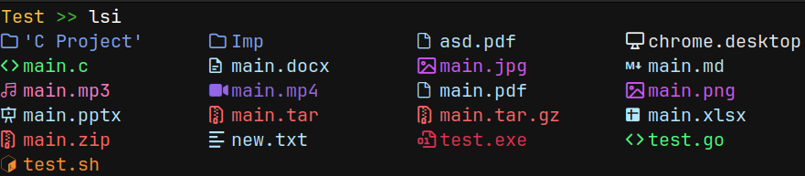
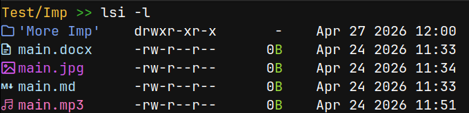
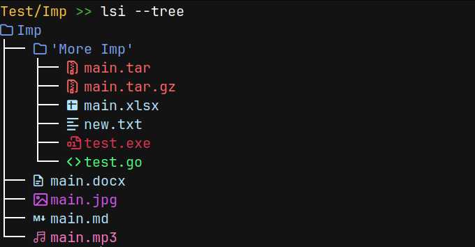

# lsi

> Because plain `ls` was not enough.

A modern file lister with file type icons, true colors, smart sorting, tree view and a config file.

<h3>Default View</h3>

<h3>Detailed View (-l)</h3>

<h3>Tree View (--tree)</h3>


## Features

- File type icons using Nerd Fonts
- True color support — 16 million colors
- Smart sorting — directories first, then files alphabetically
- Detailed view with permissions, size and date
- Tree view with configurable depth
- Config file for persistent settings
- Hidden files toggle
- Sort by name, size or date
- Works with any path

---

## Requirements

- A [Nerd Font](https://www.nerdfonts.com/) installed and set as your terminal font
- A terminal with true color support (GNOME Terminal, Kitty, Alacritty etc)
- Linux (macOS may work but is not officially tested, Windows is not supported)

---

## Tested On

| Component | Version |
|---|---|
| OS | Fedora 43 |
| Terminal | GNOME Terminal |
| Font | JetBrains Mono Nerd Font |
| Compiler | GCC 15.2.1 20260123 (Red Hat 15.2.1-7) |

---

## Installation

```bash
git clone https://github.com/Rajdeep-Nemo/lsi
cd lsi
make install
```
> **Note:** `lsi` is installed to `/usr/local/bin` — user space, not system wide. `sudo` is only required to copy the binary there. No system files are modified.

---

## Uninstall

```bash
make remove
```
> **Note:** This removes both the binary from `/usr/local/bin` and the config file at `~/.config/lsi/`.
---

## Usage

```bash
lsi                  # list current directory
lsi /path/to/dir     # list specific directory
lsi -a               # show hidden files
lsi -l               # detailed view
lsi -1               # one entry per line
lsi -r               # reverse sort
lsi -s               # sort by size
lsi -t               # sort by date modified
lsi --tree           # tree view, default depth 1
lsi --tree=3         # tree view, depth 3
lsi --no-icons       # temporarily disable icons
lsi --no-color       # temporarily disable colors
```

---

## Config

Config file is located at `~/.config/lsi/lsi.conf` and is created automatically on first run.

```ini
icons=true
color=true
```

### Permanently change config:

```bash
lsi --set-icons=false    # disable icons
lsi --set-icons=true     # enable icons
lsi --set-color=false    # disable color
lsi --set-color=true     # enable color
```

---

## Flag combinations

```bash
lsi -la              # detailed view with hidden files
lsi -rs              # reverse sort by size
lsi -rt              # reverse sort by date
lsi -a --tree=2      # tree view with hidden files
```

---

## Project Structure

```
lsi/
├── main.c          → main logic and argument parsing
├── style.c         → icons and colors
├── style.h
├── sort.c          → sorting
├── sort.h
├── detailed.c      → detailed view
├── detailed.h
├── tree.c          → tree view
├── tree.h
├── config.c        → config file handling
├── config.h
├── entry.h         → shared Entry struct
├── colors.h        → color definitions
├── assets          → contains screenshots
├── Makefile
├── LICENSE
├── .clang-format
├── .gitignore
└── README.md
```

---

## Author

[Rajdeep Nemo](https://github.com/Rajdeep-Nemo)

---

## License

MIT License — Copyright (c) 2026 RAJDEEP NEMO

See [LICENSE](LICENSE) for full text.